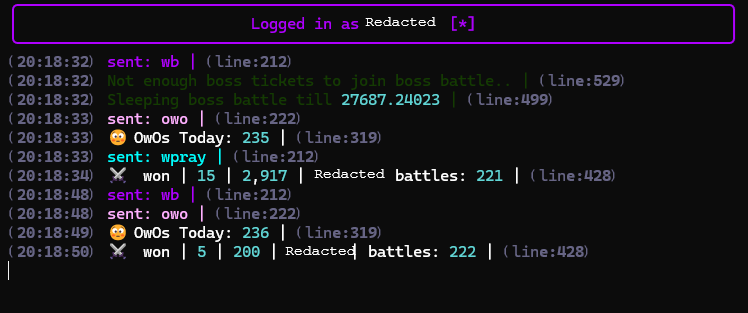

## `dawn.py`

> A simpler version of `owo-dusk` with input system.

### Controls

| Key |  Command | | Key |  Command |
| :---: | :--- | :---: | :---: | :--- |
| **`1`** | Toggle Battle  | | **`8`** | Open Lootboxes |
| **`2`** | Toggle Hunt    | | **`R`** | Watchdog Unpause |
| **`3`** | Toggle OwO     | | **`W`** | Toggle Open Website |
| **`4`** | Toggle Pray    | | **`=`** | + 0.25 Cooldown |
| **`5`** | Toggle Curse   | | **`-`** | - 0.25 Cooldown |
|  | Toggle Open Crates  | | **`C`** | Toggle Captcha |
|  | Open Boss Crates    | | **`X`** | Exit |

### Preview

---

## `dumper.py`

> A library to turn everything into JSON, more specifically `discord.py-self` message objects.

---

## `reroll.py`

> Auto reroll weapons.

---

## `weapons.py`

> Save weapons to neonutil database.

---

# *Credits*

* My brother [EchoQuill](https://github.com/EchoQuill) the best coder in Tel Aviv respect's [owo-dusk](https://github.com/owo-dusk/owo-dusk)

    For `components_v2`, `captcha_solver`, `dawn.py` and 🧠

---

